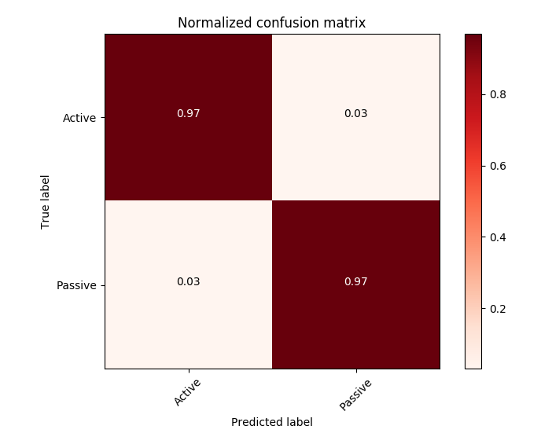

# PASS2ACT

#### Author : Daniel Nohimovich & Zhekai Jin (Scott)
#### Course : ECE 467 Natural Language Processing
#### Instructor : Professor Carl Sable

## Description
A passive to active voice transformer based on an existing dependency parser. The data pipleline processes the parser result to detect whether a sentence is passive. Then, transformations are performed on the parse tree to change the sentence to active voice if there is an agent in the original sentence. The result is rendered both in parser-tree-form visualization and text format.

## Dependency
* [Python3](https://www.python.org/download/releases/3.0/)
* [Spacy](https://spacy.io/)
* [pattern](https://www.clips.uantwerpen.be/pages/pattern-en)


## Usage
```
pip3 install -U spacy
python3 -m spacy download en
python3 demo.py

```
Then follow the instruction as prompted.

## Assumptions
* The whole data pipeline relies on th result of the parser tree result, which is assumed to be correct.
* Input is generally a statement but not in question form.

## Workflow

**Given:**

+ an statement sentence in English
+ a dependency parser tree labbeled with POS tag is formed with an existing parser

**Decision Making:**

+ the dependency parser we use distinigishes passive subjects from normal subjects in its grammer
+ the existence of a passive subject or a passive auxilary verb implies that a sentence is passive

**Transform:**

+ the subject and object are inverted according to a lookup table
+ the root verb and its auxilaries are conjugated based on a couple naive rules
+ finally the sentence is built up by joining the individual phrases in an active order with an attempt to accomdate miscellaneous clauses
+ if a sentence has an independent clause within it that is also passive the algorithm will recursively transform that clause as well

## Running Time
+ Besides the initial parsing the algorithm to actually transform the sentence to active runs in approximately linear time.


## Robustness:
The algorithm take edge cases into consideration and resolve recursive passive voice, but the wrong & ambiguous parser result will lead to err performance.


## Performance Testing
* The testing was performed with a limited database and only the detection was tested since the transformed sentence has mutiple valid forms. The detection testing give 97% recall and 97% precision, and the err case was actually due to the err parser result. Without an existing baseline method to compare with, the algorithm was concluded to give a eligible passive voice detection.




## Future Improvement

+ Question form :
	+ The question form sentence could be resolved in a better form.

+ Parser tree result correction:
	+ if the sentence has clear feature that could be detected to check with the parser tree to prve its validness, we could add error detection and correction on the parser result to improve the Robustness.
+ Feature selection:
	+ More features or edge cases could be tested and considered.

+ Muti Language support:
	+ More languages could be included with different head parameters.
